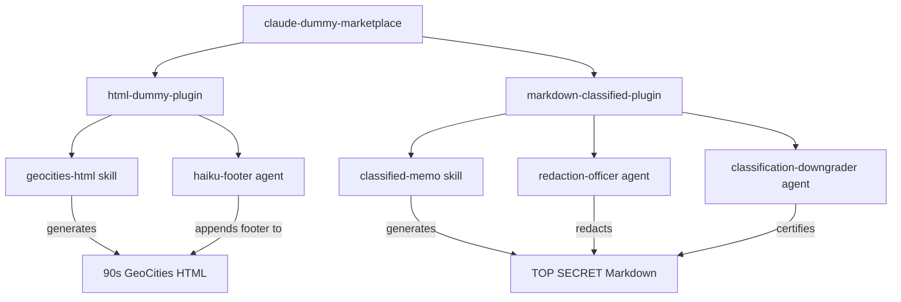

# claude-dummy-marketplace

[](LICENSE)
[](https://claude.ai/code)

> A demo Claude Code plugin marketplace with distinctively styled output generators.

This marketplace bundles Claude Code plugins for testing and demonstration purposes. It ships two plugins — **html-dummy-plugin** for 90s GeoCities-style HTML pages and **markdown-classified-plugin** for TOP SECRET government memo-style markdown documents.

## Features

- **GeoCities HTML Skill** — generates retro 1997-style web pages with visitor counters, webrings, and table-based layouts
- **Haiku Footer Agent** — appends a zen haiku poem footer to any generated HTML, styled in deliberate contrast to the surrounding page
- **Classified Memo Skill** — generates markdown styled as declassified TOP SECRET government memos with redaction blocks and classification banners
- **Redaction Officer Agent** — reviews documents and applies additional ██████ redaction blocks over "sensitive" passages
- **Classification Downgrader Agent** — appends an official declassification review certificate with ASCII-art authority block
- **Marketplace Structure** — demonstrates the standard Claude Code marketplace/plugin layout for plugin developers

## Architecture



## Project Structure

```
├── .claude-plugin/
│   └── marketplace.json      # Marketplace manifest
├── plugins/
│   ├── html-dummy-plugin/
│   │   ├── .claude-plugin/
│   │   │   └── plugin.json   # Plugin manifest
│   │   ├── skills/
│   │   │   └── geocities-html/
│   │   │       └── SKILL.md  # GeoCities HTML generation skill
│   │   └── agents/
│   │       └── haiku-footer.md  # Haiku footer agent
│   └── markdown-classified-plugin/
│       ├── .claude-plugin/
│       │   └── plugin.json   # Plugin manifest
│       ├── skills/
│       │   └── classified-memo/
│       │       └── SKILL.md  # Classified memo markdown skill
│       └── agents/
│           ├── redaction-officer.md    # Redaction agent
│           └── classification-downgrader.md  # Declassification cert agent
├── .claude/
│   └── settings.json         # Claude Code settings
└── README.md
```

## Quick Start

### Installation

```bash
git clone https://github.com/lukaskellerstein/claude-dummy-marketplace.git
```

### Usage

Add this marketplace to your Claude Code configuration, then use the plugins:

1. **Generate a GeoCities page** — ask Claude Code to generate any HTML and the geocities-html skill will produce a retro 90s page
2. **Haiku footer** — the haiku-footer agent automatically appends a zen haiku to generated HTML
3. **Generate a classified memo** — ask Claude Code to generate any markdown and the classified-memo skill will produce a TOP SECRET government document
4. **Redaction officer** — the redaction-officer agent adds ██████ blocks over "sensitive" passages
5. **Declassification cert** — the classification-downgrader agent appends an official release certificate

## Plugin Details

### geocities-html (Skill)

Generates HTML styled like a 1997 GeoCities homepage. Every page includes:

- Black background with neon green/hot pink text
- Comic Sans MS everywhere
- Marquee tags, visitor counters, guestbook links
- Table-based layouts (no divs allowed)
- Webring navigation and "Under Construction" banners

### haiku-footer (Agent)

Appends a minimalist haiku footer before `</body>` in any HTML content. The footer uses Georgia serif with muted grays — intentionally clashing with the surrounding style for contrast.

### classified-memo (Skill)

Generates markdown styled as a declassified TOP SECRET government memorandum. Every document includes:

- Classification banners (`TOP SECRET // NOFORN // ORCON`)
- Document control block with agency, ID, and handling caveats
- Bureaucratic section numbering and passive-voice prose
- Redaction blocks (`██████████████`) with FOIA justification codes
- Handwritten margin annotations and approval stamps
- References to classified appendices not included in the release

### redaction-officer (Agent)

Reviews generated markdown and applies additional redaction blocks over passages deemed "too specific" or "operationally sensitive." Leaves enough words visible that the reader can almost — but not quite — understand what was said. Appends a formal redaction log table.

### classification-downgrader (Agent)

Appends an ASCII-art declassification review certificate with a unique case number, reviewing authority (redacted, naturally), and formal determination language certifying the document for public release.

## Contributing

Contributions are welcome! To add a new plugin:

1. Fork the repository
2. Create a plugin directory under `plugins/`
3. Add a `.claude-plugin/plugin.json` manifest
4. Add skills and/or agents
5. Register the plugin in `.claude-plugin/marketplace.json`
6. Open a Pull Request

## License

MIT
